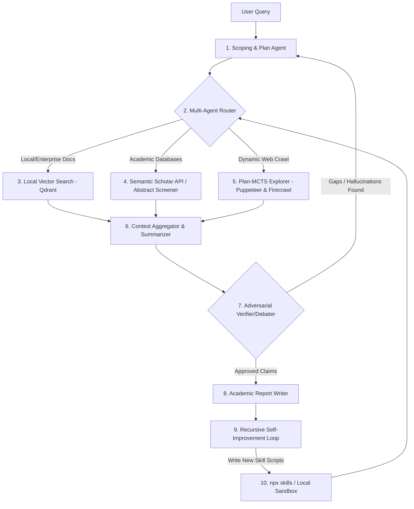
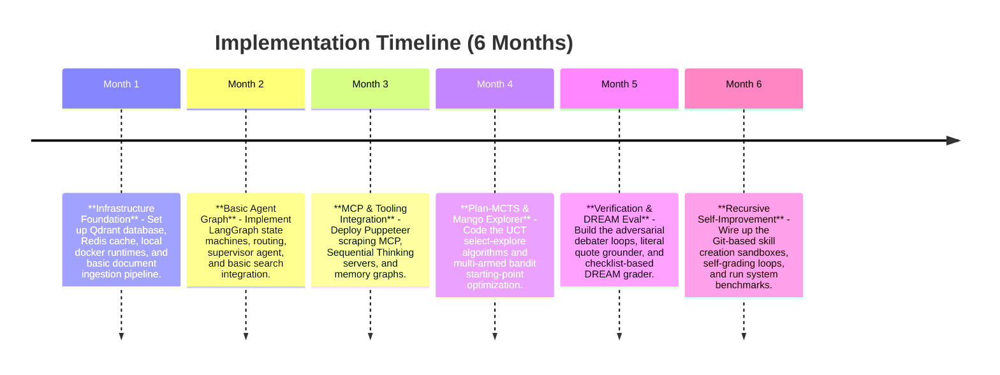

# Agentic Deep Research: Master Architecture & Handoff Blueprint

This document compiles, compares, and synthesizes the deep research findings from ChatGPT and Gemini. It establishes the master architecture for the **Ultimate Deep Researcher**—an autonomous, recursively self-improving agentic platform— and provides a detailed **Handoff Prompt** to initialize the coding phase in a new conversation.

---

## 1. Executive Comparison: ChatGPT vs. Gemini Reports

The two deep research reports generated by ChatGPT and Gemini address fundamentally different paradigms of information retrieval and generation:

| Dimension | ChatGPT Report | Gemini Report | Synthesis (The Target System) |
| :--- | :--- | :--- | :--- |
| **Focus** | **Enterprise RAG System**: Ingesting, chunking, and querying static document databases. | **Autonomous Agentic Research**: Long-horizon web exploration, multi-agent topologies, and self-correction. | **Hybrid Intelligent Platform**: A system that utilizes secure, high-performance local indexing (RAG) and dynamic, autonomous web/academic browsing (Agents). |
| **Architectural Depth** | Focuses on database setup (Qdrant/Milvus), vector indexes (HNSW), API hosting, caching (Redis), VPC security, and monitoring. | Focuses on multi-agent execution loops, MCP servers, dynamic tool/skill package execution, and advanced search algorithms. | Integrates the database, cache, and monitoring layers as the base infrastructure for a multi-agent routing graph. |
| **Exploration Heuristics** | Direct semantic similarity queries (cosine similarity) in vector databases. | Plan-MCTS (Plan-Space Tree Search), Mango (Thompson Sampling URL routing), and RLWF. | Implements a dual-engine: vector search for local context and Plan-MCTS/Mango for complex web navigation. |
| **Verification & Quality** | Standard prompt-engineering and metadata injection in RAG contexts. | Adversarial debater loops, Elicit-style abstract/full-text screening, and DREAM evaluations. | Dedicated adversarial evaluator nodes that verify generated claims against source document coordinates. |

---

## 2. Master System Architecture: The "Ultimate" Deep Researcher

To build the ultimate deep research platform, we merge the infrastructure-level optimizations from the ChatGPT report with the agentic reasoning, protocol compliance, and advanced search algorithms from the Gemini report.



### Core Architectural Pillars

#### 1. Ingestion, Indexing, and Caching Infrastructure (ChatGPT Core)
* **Vector Store**: A self-hosted **Qdrant** database running HNSW indexing, configured to handle dynamic metadata filtering.
* **Embeddings**: Local `all-mpnet-base-v2` (for private data) and OpenAI `text-embedding-ada-002`/Gemini embeddings (for public data).
* **Caching Layer**: **Redis** serving as a semantic cache for query-to-embedding lookups and document caching to reduce upstream API token usage by up to 90%.
* **Observability**: **Prometheus + Grafana** tracking latency percentiles (retrieval vs. LLM generation) and token budget allocation.

#### 2. Model Context Protocol (MCP) Gateway (Gemini Core)
* **Web Search MCP**: Bridges the LLM to Brave/Google Search API.
* **Scraping MCP**: Headless **Puppeteer/Playwright** instances that execute dynamic user actions (e.g., dismissing paywalls, rendering dynamic content).
* **Sequential Thinking MCP**: Enforces logical discipline via `@modelcontextprotocol/server-sequential-thinking`, requiring the agent to log thoughts across defined stages and revise its pathways dynamically.
* **Memory Graph MCP**: Maintains a dynamic, semantic knowledge graph during execution to track relationships between topics, entities, and URLs.

#### 3. Advanced Planning and Exploration Algorithms
* **Plan-MCTS (Plan-Space Monte Carlo Tree Search)**: Rather than planning web browser actions at the DOM element level (clicking, typing), the explorer reasons over high-level natural language intents (subplans). Selection is governed by the Upper Confidence Bound Applied to Trees (UCT) formula, with dynamic repair rules to bypass UI bugs.
* **Mango (Thompson Sampling starting-point selection)**: Prevents redundant web traversal by modeling URL starting-point selection as a Multi-Armed Bandit. It maintains Beta distributions for candidates, choosing URLs that maximize the probability of locating target information.
* **Dual-Lane Execution Framework (RigorPilot style)**:
  * *Trusted Lane*: Strictly read-only analysis of local repositories, outlines, and databases.
  * *Explore Lane*: Sandboxed execution of code, evaluations, and modifications inside dedicated containers or isolated git branches.

#### 4. The Recursive Self-Improvement Loop
To achieve true self-adaptation, the system runs an automated optimization cycle:
1. **Performance Evaluation (DREAM)**: The system evaluates its own output using the DREAM (Deep Research Evaluation with Agentic Metrics) protocol, checking Key-Information Coverage (KIC), Reasoning Quality (RQ), and Factuality.
2. **Deficit Identification**: If DREAM reports low scores in specific domains (e.g., parsing table data or handling a specific search query type), the supervisor isolates the code block or tool definition responsible.
3. **Sandbox Code Compilation**: The agent enters its *Explore Lane*, writes an optimized script or builds a new skill (using the `npx skills` directory structure), and runs unit tests.
4. **Git Versioning & Integration**: Once unit tests pass, the agent commits the new skill to the `.agents/skills` repository, dynamically registering it for future research loops.

---

## 3. Implementation Roadmap



---

## 4. Handoff Prompt for Codebase Initialization

Copy and paste the prompt below into a new workspace/conversation to instruct the coding agent to begin building the platform.

```markdown
# Role and Context
You are a Principal AI Systems Engineer and Core Developer. We are building the "Ultimate Deep Researcher"—an autonomous, self-correcting, and recursively self-improving deep research platform. 

We have already completed the theoretical systems research. Your task is to initialize the codebase in this workspace and implement the system step-by-step.

# Project Stack
- **Backend & Logic**: Python, FastAPI, Asyncio, LangGraph (for multi-agent coordination).
- **Database & Cache**: Qdrant (Vector DB), Redis (Caching and State store).
- **Tooling Protocols**: Model Context Protocol (MCP) servers (Brave Search, Puppeteer/Playwright scraper).
- **Skill Engine**: Vercel Labs' `npx skills` directory specification (YAML metadata, schema validations).
- **Environment**: Docker containers for isolated runtime sandboxing (Trusted vs. Explore lanes).

# Initial Project Layout
Establish the following directory structure in the root:
- `/config`: Configuration schemas and environment management.
- `/core`: The core LangGraph state machine, state definitions, and supervisor router.
- `/db`: Connection clients and indexing layers for Qdrant and Redis.
- `/mcp`: Custom MCP servers (e.g., sequential thinking, knowledge graph, browser automation).
- `/skills`: The dynamic directory where the agent can save its newly compiled/installed skill scripts.
- `/tests`: Pytest suite for regression testing and DREAM evaluations.

# Core Implementations Required in Step 1
1. **Define the State Graph**: Write the core LangGraph state (`StateGraph`) defining the schema for the research brief, memory graph, and cumulative report state.
2. **Setup Qdrant & Redis integration**: Write the database connection modules, embedding generators (supporting local sentence-transformers), and a basic semantic cache layer.
3. **Scoping Node**: Implement the `clarify_with_user` and `write_research_brief` nodes, ensuring user validation before research execution begins.

Begin by setting up the folder structure, initializing git, and writing the base configuration file. Present a detailed breakdown of your file structure first, and wait for my confirmation before generating the code files.
```
