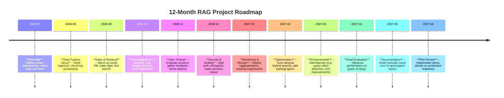

# Executive Summary  
Retrieval-Augmented Generation (RAG) augments LLMs with external knowledge by retrieving relevant documents at query time. For a specialised enterprise knowledge base, a small-scale production-ready RAG system typically involves an **ingestion pipeline** (to collect, clean, chunk and embed data), a **vector search index** (to store embeddings), and an **LLM component** (to generate answers using the retrieved context). Key trade-offs include choosing between open-source vs commercial tools, balancing accuracy vs latency, and ensuring security for sensitive data. We outline architecture options (on-premises vs cloud, microservices vs monolith), data workflows, and component comparisons. We recommend a modular pilot stack (e.g. open-source vector DB, sentence-transformer embeddings, a local LLM or managed API, and an orchestration framework like LangChain/Haystack) for 10–50 users, with a roadmap of design, build, test, and optimize phases over 12 months. Security (encryption, access control), monitoring (logging, metrics), and maintenance (data/model updates) are integral throughout. The following report details each aspect, with diagrams, code snippets, comparison tables, and a Gantt-style timeline.

## Architecture Options  
A RAG system typically has three stages (diagram below):
- **Data Ingestion & Indexing Pipeline:** Crawling or importing domain documents; cleaning, splitting into chunks; generating embeddings; writing vectors (and optionally text) into an index.  
- **Retrieval Module:** At query time, convert user queries into embeddings; search the vector DB (and/or sparse index) to retrieve top-K relevant chunks.  
- **Generation Module:** Feed retrieved context plus the query into an LLM (prompt template) to generate answers or summaries.  

```mermaid
flowchart LR
    subgraph Ingestion_Pipeline [Data Ingestion & Indexing]
        A[Raw Data Sources<br/>(docs, DB, web)] --> B[Preprocessing & Chunking];
        B --> C[Embedding Model];
        C --> D[Vector Database & Text Index];
    end
    subgraph Query_Flow [Query & Retrieval]
        Q[User Query] --> E[Query Embedding];
        E --> F{Search Strategy};
        F -->|Vector Search| D;
        F -->|Sparse/BM25 Search| G[(Full-Text Index)];
        D --> H[Top-K Results];
        G --> H;
    end
    subgraph Generation [LLM Answer Generation]
        H --> I[LLM (with Retrieved Context)];
        I --> J[Generated Answer];
    end
```

Each block above can be implemented in various ways. For example, the **Vector Database** could be Qdrant, Milvus, Weaviate, Pinecone, Chroma, etc. The **Embedding Model** might be an open-source transformer (e.g. Sentence-BERT) or a managed API (e.g. OpenAI Ada-embedding). The **LLM** could be open (Llama 3, Mistral, etc.) or closed (GPT-4/3.5, Claude), depending on cost, latency, and data-sensitivity requirements. The system can be deployed entirely on-premises (for sensitive data) or in the cloud (for ease and scalability), or a hybrid. A common pattern is a microservices architecture (each component containerized with REST/gRPC interfaces) managed via K8s or a similar orchestration platform, enabling independent scaling of ingestion workers, vector DB, and LLM serving. Alternatively, a simpler monolithic application can be used for a small pilot (see **Recommended Stack** below).  

## Data Ingestion and Indexing Pipeline  
A robust pipeline is essential to ensure the knowledge base stays current and relevant. Key steps:  
1. **Content Collection:** Ingest documents from enterprise sources (databases, file shares, websites, APIs). Tools may include web crawlers (e.g. Talay by [tavily] for scraping web content), custom connectors, or database export scripts.  
2. **Preprocessing:** Clean text (remove HTML/markdown, de-duplicate). **Chunking:** Break long texts into semantically-coherent chunks (e.g. 200–500 words or 512–1024 token chunks), possibly with overlap for context continuity. Good chunking (topic/paragraph boundaries) is crucial for retrieval quality.  
3. **Embedding Generation:** Use an embedding model to map each chunk to a fixed-size vector (e.g. 384–1536 dimensions). For non-sensitive data, cloud APIs like OpenAI’s `text-embedding-ada-002` (1536-d vectors) are common. For sensitive data, open models (e.g. [all-mpnet-base-v2](https://huggingface.co/sentence-transformers/all-mpnet-base-v2)) run in-house.  
4. **Indexing:** Store the embeddings (and metadata) in a vector database. Many systems also store the original text (or references) alongside vectors. A good vector DB supports ANN search (HNSW or IVF) and optionally hybrid search combining vector+keyword. E.g. Qdrant, Weaviate, Milvus (open-source), or Pinecone, Chroma Cloud (managed). See [Comparison Table] below.  
5. **Pipeline Infrastructure:** This can be implemented using workflow tools (e.g. Apache Airflow, Prefect) or in lightweight scripts. For example, using Python with libraries like *langchain*, *haystack*, or *transformers*:  

```python
from sentence_transformers import SentenceTransformer
from qdrant_client import QdrantClient
from qdrant_client.http.models import PointStruct

# Step: Initialize embedding model and vector DB client
embed_model = SentenceTransformer('all-mpnet-base-v2')
qdrant = QdrantClient(host='localhost', port=6333)

# Step: Read and chunk documents (pseudocode)
documents = load_documents_from_source(...)  # e.g. read files or DB rows
chunks = []
for doc in documents:
    chunks.extend(chunk_text(doc, max_len=500))

# Step: Compute embeddings
ids = []
embeddings = []
metadatas = []
for i, chunk in enumerate(chunks):
    vec = embed_model.encode(chunk)
    ids.append(f"chunk-{i}")
    embeddings.append(vec.tolist())
    metadatas.append({"text": chunk})

# Step: Create collection/index and upload vectors
qdrant.recreate_collection(collection_name="kb", vectors_config={"size": len(embeddings[0])})
qdrant.upload_collection(
    collection_name="kb",
    points=[PointStruct(id=ids[i], vector=embeddings[i], payload=metadatas[i]) for i in range(len(ids))]
)
```

Here, `chunk_text` is a user-defined function to split text. In practice, batching embeddings and parallelism (for large corpora) is needed. Many frameworks automate this pipeline (e.g. *haystack*, *langchain*) but custom code allows full control. After indexing, the system can periodically re-run ingestion (e.g. nightly) to update new documents, and triggers to re-index changed data.

## Vector Database Choices  
Key features of a vector database include: **ANN indexing** (e.g. HNSW for fast approximate nearest neighbor search), scalability (able to store millions of vectors), persistence/replication, and optional hybrid search (combining vector + sparse search). Below is a non-exhaustive comparison:

| **Database** | **Type**        | **License**  | **Pros**                                                 | **Cons**                                                | **Pricing (approx)**            |
|--------------|-----------------|--------------|----------------------------------------------------------|---------------------------------------------------------|---------------------------------|
| **Qdrant**   | OSS/managed     | Apache 2.0   | High performance (Rust); easy Python client; HNSW index. In-cloud and on-prem. Active community. | Self-hosting requires ops; Cloud service has pay-as-you-go pricing. | Free self-hosted; Qdrant Cloud free tier + usage (>$50/mo for medium workloads). |
| **Weaviate** | OSS/managed     | BSD-3        | GraphQL/REST API; built-in hybrid search (BM25+vector); supports GraphQL. Modules for ML ops. | Slightly higher mem usage; premium features in cloud version. | Free self-hosted; Cloud Flex $45+/mo, Plus $280+/mo (vector+storage costs). |
| **Milvus**   | OSS (Zilliz)    | Apache 2.0   | Highly scalable; supports both HNSW and IVF; integrates with Faiss. Kubernetes support. | Requires more config; fewer language clients.  | Free self-hosted; Zilliz Cloud plans from ~$0.30/GB-month. |
| **Pinecone** | Managed SaaS    | Proprietary  | Fully managed; auto-scaling; simple API; build-in monitoring; commercial support. | Vendor lock-in; can be costly at scale; fixed service limits. | Free tier (up to small size); paid from ~$0.10-0.30/GB-month + query units. |
| **Chroma**   | OSS/managed     | Apache 2.0   | Optimized for cloud storage backends; simple embedding store; low latency for moderate sizes. | Newer project; less mature community; managed “Chroma Cloud” pricing per GB. | Self-hosted free; Cloud ~$5/GB stored. |
| **Redis-Vector** (Redis v7) | OSS | Apache 2.0 | Leverages Redis ecosystem; supports basic vector search (HNSW); transactional; caching. | Not specialized for large-scale ANN (no advanced index types); memory-bound. | Redis Enterprise pricing or self-hosted free. |

*(Note: Pricing is indicative and for planning only; actual costs vary by region and usage. Licensing can change.)*  

Each vector DB above supports storing payload/metadata (e.g. text, IDs) to retrieve the actual content. For pilot projects, an open-source DB (Qdrant or Milvus) on a single server is common to avoid cloud lock-in and to control costs. Commercial options (Pinecone, Weaviate Cloud) speed deployment but incur ongoing fees. For sensitive data, on-premise OSS versions are safer; for non-sensitive or rapid prototyping, managed services simplify ops.

## Embedding Models  
Embeddings convert text into vectors. Options include:  

- **Open-source Transformer embeddings:** e.g. Sentence-Transformers (Hugging Face) models like `all-mpnet-base-v2` (768-d), `paraphrase-multilingual-MiniLM-L12-v2` (384-d), or specialized (SciBERT, BioBERT for domain text). Pros: free, customizable (can fine-tune), run anywhere (CPU/GPU). Cons: slower than optimized cloud APIs; larger models need GPU for speed.  
- **Proprietary cloud embeddings:** e.g. OpenAI’s `text-embedding-ada-002` (1536-d), Cohere’s `embed-english-v2.0` (1024-d), Google’s Universal Embedding (via PaLM API). These often provide high-quality semantic vectors and easy usage, but cost per token (e.g. Ada-002 is ~$0.0001/1k tokens) and require sending data to the provider.  
- **Hybrid/Multimodal:** Some systems support image or audio embeddings for non-text data (Weaviate modules, Pinecone transforms), if needed.

**Trade-offs:** Higher-dimensional embeddings (e.g. 1536-d) can capture nuance but require more storage/compute. Lower-d (384-d) is faster and lighter but may lose detail. The choice may depend on domain complexity: specialized knowledge (e.g. legal, medical) might benefit from fine-tuned or domain-specific models. 

**Implementation:** A typical approach is to embed each chunk once and store. If the model or text changes, embeddings must be recomputed. For incremental data, newly added chunks are appended to the index.  

```python
# Example: Embedding and indexing with sentence-transformers
docs = ["Text chunk 1", "Text chunk 2", ...]
model = SentenceTransformer('all-mpnet-base-v2')
embeddings = model.encode(docs, convert_to_tensor=True, show_progress_bar=True)
# Then write embeddings to vector DB (as above)
```

## LLM Choices (Generative Model)  
The LLM consumes the retrieved context to generate answers. Options fall into **closed-source managed** vs **open-source self-hosted**:

- **Closed APIs:** OpenAI’s GPT-4/GPT-3.5, Anthropic’s Claude, Google’s Gemini, etc. These often yield state-of-the-art quality and are easy to integrate via API, with predictable scaling. Costs are per-token (e.g. GPT-4 Turbo ~$0.03/1k prompt tokens, GPT-3.5 ~$0.002). Latency depends on API and network. Pros: No infrastructure management, constant improvements. Cons: Data privacy concerns, reliance on external service, potentially high costs at scale.
- **Open models (on-prem):** Examples include Meta’s Llama 3 (available up to 34B parameters), Mistral AI’s Mistral Large (8B, 14B) and Mixtral (mix of Mistral/StableLM), Hugging Face’s Falcon, Vicuna (fine-tuned Llama), etc. These can run on local GPUs or through self-hosted inference engines. For a pilot, smaller models (7–13B) are often used to balance resource use with quality. Pros: Full data control; no per-query cost; can run disconnected. Cons: Need GPU hardware; more DevOps effort; model quality may lag top commercial models.  
- **Performance/Latency:** Large closed models often serve from high-end GPUs, giving 1–2 seconds per request (for moderate prompt sizes). Small open models (e.g. 7B on a GPU) can be sub-second for short contexts. Quantization (e.g. 4-bit) and batching can improve speed at some accuracy cost.

For a 10–50 user pilot, one might start with a lower-cost closed model (GPT-3.5 Turbo) for convenience, then potentially migrate to an open model (Mistral 7B or Vicuna 13B) if latency or cost is a concern and data sensitivity demands. The system should support plugging in different model endpoints transparently (e.g. via a proxy service). 

## Retrieval Strategies  
RAG retrieval determines which documents feed the LLM. Common strategies:  

- **Sparse (token-based) retrieval:** Uses traditional IR methods like TF-IDF or BM25 (often via Elasticsearch or OpenSearch). Fast and well-understood for keyword queries. However, it only matches exact terms or stems, missing semantic meaning. Useful for broad keyword filtering or fallback.  
- **Dense (vector) retrieval:** Uses semantic embeddings in a vector DB (as above). Captures conceptual similarity beyond exact words. More effective for paraphrase queries but requires embedding both query and documents.  
- **Hybrid retrieval:** Combines both. For example, first retrieve candidates with BM25, then re-rank them by vector similarity, or vice versa. Some vector DBs natively support hybrid queries (e.g. Weaviate and Qdrant via plugins), leveraging both relevance signals.  
- **Reranking:** Regardless of initial retrieval, a smaller set of candidates may be fed to a cross-encoder or LLM for fine-grained ranking. E.g. using BERT-based cross-attention or even having the LLM judge relevance. This improves accuracy but adds latency.  
- **Multimodal or other:** (if needed) e.g. combining knowledge graph lookups, image search results, or API calls (MCP-style) as additional context. For strict RAG, focus is on text/vector retrieval.

**Implementation note:** A simple pilot might stick to vector retrieval alone, as it covers most use-cases and simplifies the stack. For enterprise-grade, hybrid retrieval can boost precision (especially on technical terms or names). For example, one might run an Elasticsearch index on chunks, use its BM25 to filter to top-50 candidates, then rank those via vector similarity in Qdrant.  

**Caching:** To reduce latency and costs, implement caching at two levels:  
- **Query caching:** E.g. cache the top-K documents for popular queries (in Redis) to bypass repeated retrieval.  
- **LLM answer caching:** If identical queries recur, store the generated answer (if allowed).  
- **Semantic cache:** Store (query→embedding) or (embedding→nearest neighbors) to avoid re-computation. Libraries like Haystack support a “semantic cache” table to quickly match frequent queries.

Latency can also be improved by optimizing ANN parameters (e.g. smaller HNSW `ef_search` for speed at slight quality cost) and by batching requests. If using a GPU LLM, ensure enough threads or asynchronous calls to keep the GPU busy.

## Caching & Latency Optimisation  
Given potentially high LLM/API costs and user demand, latency and cost optimizations are critical for smooth experience:  

- **ANN indexing parameters:** Fine-tune the index construction (e.g. HNSW layer count, `ef_construction`, number of partitions in IVF) to balance query speed vs recall. Larger indexes (more data) may need sharding or multiple replicas.  
- **Quantization:** For in-house models and vector DBs, apply 8-bit or 4-bit quantization to reduce memory and inference time, at minimal quality loss. (E.g. Mistral or Llama can be 4-bit quantized for deployment.)  
- **Batching:** When handling multiple queries, batch embed/model calls to utilize GPU effectively.  
- **Asynchronous pipelines:** Use async I/O for database and API calls to avoid blocking and overlapping work.  
- **Caching layers:** Use Redis or in-memory caches for repeated queries or sub-query computations. For instance, caching recent query embeddings can skip recomputation.  
- **Caching embeddings:** If the knowledge base updates slowly, keep a static embedding store to avoid re-embedding unchanged content.  
- **Edge computing:** In geo-distributed cases, consider deploying vector DB replicas or model endpoints closer to users.

### Security and Access Control  
For enterprise data, security is paramount. Key measures:  
- **Data encryption:** Ensure embeddings and text in the vector DB are encrypted at rest (disk encryption) and in transit (TLS). Many managed DBs offer built-in encryption; self-hosted solutions should use secure infrastructure (e.g. storage volumes with AES-256 encryption).  
- **Network security:** Deploy within a VPC or isolated network. Access to the vector DB and LLM endpoints should be firewalled and accessible only by the application layer or authorized users. Use VPN or private links if cloud-managed services are used.  
- **Authentication & Authorization:** Protect APIs (both ingestion and query) with strong auth (OAuth, API keys) and role-based access control. Example: Only certain services or user roles can trigger data ingestion or index rebuilding; normal users can only query the RAG API.  
- **Data governance:** If data is sensitive (e.g. PII, proprietary docs), avoid using external APIs that might log content. For closed models (OpenAI, etc.), use “enterprise” or “isolated” offerings or encrypt data before sending (if supported). Track compliance (GDPR, HIPAA) by logging access and anonymizing as needed.  
- **MCP & Tools:** For sensitive tasks, consider using protocols like Model Context Protocol (MCP), which allow models to call approved tools/APIs without exposing raw data externally. Also, agent frameworks (e.g. [skills.sh](http://skills.sh/)) provide modular “skills” that can encapsulate logic without leaking context.

## Monitoring and Maintenance  
A production RAG system must be monitored and regularly maintained:  

- **Logging and Metrics:** Log query patterns, response times (retrieval time, LLM generation time), and result quality metrics if available (e.g. user feedback, answer correctness). Monitor vector DB health (index size, QPS, error rates) and model server metrics (CPU/GPU usage, latency percentiles). Tools like Prometheus/Grafana or Datadog can track these.  
- **Drift Detection:** Track data drift (e.g. vocabulary changes) or model drift. Set up periodic evaluation: for example, a held-out test set of queries to check answer quality or retrieval relevance over time. If performance drops, trigger model or index updates.  
- **Re-indexing & Updates:** Schedule re-ingestion for new or changed documents (daily/weekly as needed). Maintain idempotency in ingestion pipeline to avoid duplicates. Keep embeddings up-to-date; for example, if a new embedding model is adopted, re-run embeddings batch.  
- **Index Maintenance:** Periodically rebuild vector indexes for optimum performance (some databases require compaction or re-training). Archive or prune outdated knowledge to save resources.  
- **Security Audits:** Regularly audit who has access, rotate keys, and patch all components (DB, OS, inference servers) for vulnerabilities.  
- **Cost Monitoring:** If using paid services, monitor spend (especially for token-based APIs and cloud DB costs) against budgets. Implement usage caps or alerts.

## Implementation Steps  
A step-by-step outline to implement a pilot RAG system:

1. **Requirements & Planning (Weeks 1–2):** Define the knowledge base scope (document types, volume), user personas, and use-cases. Choose initial components: e.g. Qdrant + SBERT + Llama-13B (on a single GPU) vs Pinecone + OpenAI. Plan infrastructure (cloud vs on-prem) and required team skills.  
2. **Data Pipeline Setup (Weeks 3–6):** Develop or integrate ingestion scripts to fetch domain content. Implement text cleaning and chunking. Choose an embedding model and test embedding a few documents. Stand up the vector DB (e.g. install Qdrant or sign up for cloud service). Index the initial dataset and verify it can be queried.  
3. **Basic Retrieval Module (Weeks 7–8):** Build a simple query interface: take a user query, embed it, retrieve top-K chunks from the vector DB. Verify that results are relevant. Optionally add a sparse retrieval step and test hybrid search.  
4. **LLM Integration (Weeks 9–12):** Connect an LLM to the system. For example, call OpenAI GPT-3.5 with a prompt template that includes retrieved text. Test end-to-end: query → retrieve → answer. Evaluate answer quality with sample queries. Tune prompt and retrieval parameters (e.g. number of chunks, chunk size) for best results.  
5. **Evaluation & Iteration (Weeks 13–16):** Conduct user testing or expert review on the pilot outputs. Measure latency, correctness, and gather feedback. Identify bottlenecks (e.g. slow embeddings, missing context). Experiment with alternative models or indexing settings (e.g. different embedder or increasing search depth).  
6. **Scalability & Reliability (Weeks 17–20):** Add necessary infrastructure for resilience: containerize components with Docker, orchestrate with Kubernetes or similar. Add caching layers if needed. Ensure the system can handle concurrent use (up to ~50 users, so plan ~5–10 QPS maybe).  
7. **Security & Access Controls (Weeks 21–24):** Apply encryption, set up authentication. If using cloud APIs, configure IAM. Do a security review. Implement audit logging.  
8. **Monitoring & MLOps (Weeks 25–28):** Deploy monitoring (Prometheus, Grafana) and alerting. Optionally set up an MLflow or W&B project to track model performance and experiments. Create dashboards for query volumes, latencies, and system health.  
9. **Optimization & Feature Enhancements (Weeks 29–36):** Based on feedback, add improvements: caching for hot queries, tune retrieval parameters (e.g. moving to a hybrid strategy), or switch to a more capable LLM if needed. Begin planning for knowledge base growth (e.g. multi-lingual support, richer schema).  
10. **Pilot Review & Reporting (Weeks 37–42):** Compile documentation, user manuals, and performance reports. Decide on success criteria (accuracy, cost, response time). Present pilot results to stakeholders and plan next steps (e.g. scale-up or production rollout).

This schedule (roughly 10 months) leaves slack for unforeseen issues and peaks (e.g. final QA, holidays). The final 2 months (weeks 43–52) can be used to wrap up documentation, train support staff, and make a go/no-go decision on scaling.

## Recommended Pilot Stack (10–50 Users)  
For a pilot of this size, we suggest a balanced stack that minimizes cost and complexity while remaining production-relevant:

- **Compute/Deployment:** A small cloud or on-prem GPU server (e.g. AWS EC2 `g5.xlarge` or equivalent) for embedding and LLM inference. Containerize services (Docker) and orchestrate with Kubernetes or Docker Compose. Use GitOps for reproducibility.  
- **Data Ingestion:** A Python-based ETL pipeline (can use LangChain or Haystack for convenience) running as a scheduled job or microservice. For web data, use an open-source crawler (e.g. Scrapy, or Tavily’s tools).  
- **Vector DB:** **Qdrant** or **Milvus** on a VM (open-source, free) or a free-tier cloud service. Qdrant is easy to set up and performs well on moderate data.  
- **Embedding Model:** If not sensitive, start with OpenAI Ada (fast, high quality). Alternatively, use a small local model (e.g. `sentence-transformers/all-MiniLM-L6-v2`) to avoid API costs.  
- **LLM:** For non-sensitive use, GPT-3.5 Turbo via OpenAI API for ease. If data is sensitive or cost is a concern, use a 7–13B open model (Mistral 7B, Llama 3 13B) loaded in a local server (e.g. Hugging Face’s [Transformers Pipeline](https://huggingface.co/docs/transformers/index) or [Text Generation WebUI](https://github.com/oobabooga/text-generation-webui)).  
- **Retrieval Framework:** Use **LangChain** or **Haystack** (both Apache-licensed) to glue components. They provide abstractions for retrieval + LLM chains, and support for most DBs and models.  
- **Interface:** A simple web UI (Flask/FastAPI backend + React or Streamlit frontend) for queries and answer display.  
- **MLOps/Observability:** Basic monitoring with **Prometheus + Grafana** for infra metrics. For model logs, consider **Weights & Biases** (free tier) to track experiments. Logging via ELK (Elastic) or a hosted log service (Papertrail, Datadog).  
- **Authentication/Access:** OAuth2 or API key system for the RAG service (Auth0, Keycloak, etc. or cloud IAM). TLS everywhere.

For a fully on-prem version (sensitive data), replace APIs with local models and self-host all components. For rapid development (non-sensitive), one could use managed services: e.g. **Chroma Cloud** (vector index), **OpenAI** embeddings + LLM API, and still run the rest on a small app server.

## Caching, Latency, and Performance  
For small user count, single-instance deployments may suffice, but consider:  
- **Caching:** Deploy Redis or similar to cache recent query results.  
- **Approximate Search:** Tune ANN (e.g. reduce `search_k`) to keep retrieval <100ms.  
- **Batching:** Bundle embedding calls if multiple queries come in simultaneously.  
- **Load Testing:** Use tools like Locust to simulate 50 concurrent users to ensure <2s response time end-to-end. Optimize as needed (e.g. split query->retrieve->generate into async calls).

## Security and Access Control  
- **Onboarding:** Use least-privilege roles. Admins have DB write/edit privileges; normal users only read/query via API.  
- **Encryption:** Enable TLS for all service endpoints. Use KMS-managed keys for any persistent store encryption.  
- **Audit:** Log every query and admin action with timestamps. Implement periodic reviews.  
- **Data Sensitivity:** For classified info, ensure the LLM server is air-gapped or on a private enclave. Avoid sending any data to external clouds.

## Monitoring and Maintenance  
- **Alerts:** Set thresholds (e.g. query latency >1s, LLM error rates >1%) to trigger alerts (PagerDuty/Slack).  
- **Metrics:** Track daily ingestion volume, index size, query volume, cost per query (if on cloud).  
- **Re-Training:** Schedule an annual or biannual review to consider new embeddings or LLMs. For example, replacing SBERT with a better model or upgrading from GPT-3.5 to GPT-4 if needed.

## Comparison Table of Candidate Components  

| **Category** | **Component**         | **Pros**                                                                                           | **Cons**                                                                                  | **License**            | **Pricing (Rough)**                   |
|--------------|-----------------------|----------------------------------------------------------------------------------------------------|-------------------------------------------------------------------------------------------|------------------------|---------------------------------------|
| **Vector DB**| Qdrant                | Fast (Rust); HNSW/IVF; good Python SDK; cloud/PaaS; free OSS.                                      | Cloud costs beyond free. Self-host ops overhead.                                         | Apache 2.0             | Free OSS; Cloud ~$50+/mo for 10M vec. |
|              | Weaviate              | Hybrid search; GraphQL API; ML modules (e.g. Spacy); cloud or OSS.                                  | Cloud pricing can be high; self-host require K8s setup.                                  | BSD-3 Clause           | Free OSS; Cloud Flex $45+/mo base.    |
|              | Milvus                | Highly scalable (distributed); multiple index types; active community.                             | Some setup complexity; fewer native high-level APIs.                                     | Apache 2.0             | Free OSS; Zilliz Cloud ~$0.30/GB-mo.  |
|              | Pinecone              | Fully managed; autoscaling; multi-region; enterprise support; vector+text hybrid (single index).   | Proprietary; vendor lock-in; pricing can be steep at scale.                              | Proprietary           | Free tier; from ~$0.10/GB-mo+queries. |
|              | Chroma Cloud          | Easy DBaaS; hybrid text+vector; free tier; designed for cost-efficiency.                           | Relatively new; smaller community; costs per GB stored.                                  | Apache 2.0             | Free OSS; Cloud ~$5/GB stored.        |
| **Embeddings**| OpenAI Ada-002       | High quality; easy API; 1536-d; no ops overhead.                                                  | Cost per request; data sent externally; rate limits.                                      | Proprietary (API)     | ~$0.0001 per 1k tokens.              |
|              | SBERT (e.g. MPNet)    | Free; customizable; runs offline; many pretrained models.                                           | Slower than API; needs GPU for large loads; quality may vary by domain.                 | Apache 2.0            | Free OSS.                            |
|              | Cohere Embed         | Competitive quality; REST API; various dimensionalities.                                           | Similar cons to OpenAI (cost, external calls).                                          | Proprietary (API)     | ~$0.0004 per 1k tokens.              |
|              | Hugging Face Transformer Embeddings | Thousands of community models (varied sizes); supports fine-tuning.                       | Must self-host or pay HF Inference API; model selection overhead.                       | MIT/Apache (varies)   | Free OSS; HF Inference pay-per-use.  |
| **LLM (Gen)** | OpenAI GPT-3.5/4      | Top-tier performance; easy API; ongoing improvements; handles long context.                        | Expensive; usage-based billing; privacy concerns for sensitive data.                    | Proprietary (API)     | ~ $0.002/1k (3.5), $0.03/1k (GPT-4). |
|              | Anthropic Claude      | Very strong reasoning (esp. Claude-3); API similar to OpenAI; focus on safety.                    | Similar pricing; proprietary; fewer endpoints.                                         | Proprietary (API)     | ~~$0.004–0.012 per 1k tokens.        |
|              | Llama 3 (Meta)       | State-of-art open models (13B, 34B); permissive (Llama 3 IRL).                                     | Large size; requires high-end GPUs; licensing (Meta’s terms) may restrict some use.      | Llama License         | Free to download; inference cost = infra.  |
|              | Mistral (7B, 14B)    | Leading open models; efficient; strong multilingual; free weights.                                | Still needs GPU; newer (as of 2024).                                                    | Open (Apache-like)    | Free; run-time GPU cost.             |
|              | Falcon (Open)        | Open (BigScience) models (7B, 40B) with good performance; no API lock-in.                          | Resource intensive; older generation than Llama/Mistral.                                | Apache 2.0            | Free OSS.                           |
| **Orchestration** | LangChain         | Rich ecosystem for RAG workflows; many connectors (vector DBs, LLMs); active community.           | Library (vs end-to-end platform); some learning curve; rapid changes.                   | MIT (v3)              | Free OSS.                            |
|              | Haystack             | End-to-end RAG framework (by deepset); supports Elasticsearch, FAISS, etc.; “zero-shot” QA.        | Can be heavy; Python-only; fewer integrations than LangChain.                           | Apache 2.0            | Free OSS.                            |
|              | LlamaIndex (GPT Index)| High-level docs-to-LLM library; tree/index-based retrieval; integrates with LangChain.           | Newer; focuses on index+query rather than DB storage.                                   | Apache 2.0            | Free OSS.                            |
|              | Airflow/Prefect       | For scheduling complex ETL pipelines (ingestion workflows).                                      | More for ETL than RAG-specific orchestration.                                          | Apache 2.0 (Airflow), MIT (Prefect) | Free OSS.              |
| **MLOps/Observability** | MLflow       | Model registry and tracking; logs experiments, version control.                                  | Requires setup; primarily for training-phase, not real-time monitoring.                 | Apache 2.0            | Free OSS.                            |
|              | Weights & Biases     | Experiment tracking; artifact registry; real-time metrics; easy Python integration.               | SaaS cost beyond free tier; data hosted externally.                                     | Proprietary/SaaS     | Free tier; Team $12/user/mo.         |
|              | Prometheus/Grafana   | Open-source metrics/alerting; very flexible; popular in infra monitoring.                        | Requires self-hosting/config; mostly infra metrics (not model eval).                    | Apache 2.0            | Free OSS.                            |
|              | DataDog/NewRelic     | Hosted monitoring/logging; auto-instrumentation; dashboards.                                     | Can become costly; agent overhead.                                                     | Proprietary/SaaS     | Tiered ($) based on hosts/usage.     |

>*Notes:* “OSS”=open-source software; “SaaS”=cloud service. Pricing is ballpark (USD).

## Implementation Example (Code Snippets)  
Below is pseudocode for core steps. In practice, use appropriate libraries and error handling.

```python
# 1. Data Ingestion & Chunking
def ingest_documents(source_paths):
    docs = []
    for path in source_paths:
        text = read_text(path)
        chunks = text_to_chunks(text, max_words=300, overlap=50)
        docs.extend(chunks)
    return docs

# 2. Embedding and Indexing
model = load_embedding_model('all-mpnet-base-v2')
vec_db = connect_to_vector_db(config)
for chunk_text in ingest_documents(file_list):
    vec = model.encode(chunk_text)
    vec_db.insert(vector=vec, metadata={'text': chunk_text})

# 3. Query & Retrieval
query = "Explain the new company security protocol"
query_vec = model.encode(query)
results = vec_db.search(query_vector=query_vec, top_k=5)  # returns text chunks
context = "\n\n".join([r['metadata']['text'] for r in results])

# 4. Generation
prompt = f"Answer as an expert. Use the following context:\n{context}\n\nQuestion: {query}"
answer = llm_api.generate(prompt, max_tokens=150, temperature=0.0)
print(answer)
```

In a real app, wrap steps 3–4 in a web API (e.g. Flask endpoint). Use asynchronous calls where possible (e.g. `await llm_api.generate()`). 

## 12-Month Roadmap (Timeline)  
Below is a high-level Gantt-style timeline (mermaid). Tasks overlap where possible. The pilot is assumed to begin July 2026.



Each phase has defined deliverables. For example, by end of October 2026 the system should be able to answer queries with low latency. Milestones include “Initial RAG MVP” (October) and “Secure/Scalable RAG System” (January).

## Conclusion  
Building a small-scale production-ready RAG system involves careful selection of each component and thoughtful engineering of data and query pipelines. Open-source stacks (Qdrant/Milvus + SBERT + Llama/Mistral) allow full control and lower cost, while commercial services (Pinecone, OpenAI, Anthropic) simplify operations at higher price. For a 10–50 user pilot, we recommend starting with a minimal viable stack (one vector DB, one embedding model, one LLM) and iterating based on user feedback. Security (encryption, access control) and observability (metrics, logs) should be baked in from the start. A phased 12-month roadmap ensures systematic progress from research to deployment.  

*Note:* This report integrates insights from industry resources and frameworks (e.g. Hugging Face, Weaviate docs, vendor blogs) to inform best practices.  

**Primary References:** (for further reading, not directly cited above) Hugging Face Transformers RAG docs; Weaviate and Qdrant documentation; OpenAI API pricing page; original RAG research (Lewis *et al.*, EMNLP 2020); Firecrawl Dev RAG articles; Tavily RAG guides; and vendor whitepapers on vector databases and LLMops.