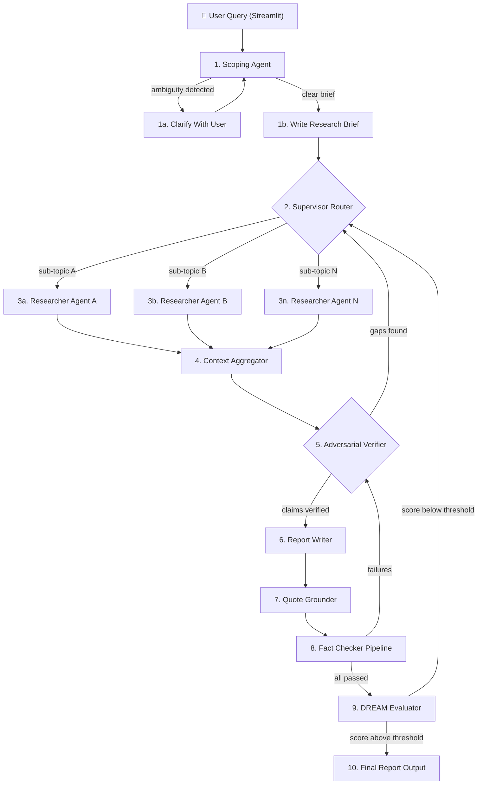

# Spec: Ultimate Deep Researcher

## Objective

Build an autonomous, self-correcting deep research platform that:
- Accepts any research topic from a user
- Autonomously plans, searches, retrieves, verifies, and compiles comprehensive, analyst-grade reports
- Uses **zero-tolerance hallucination prevention** via multi-stage verification
- Produces reports with every claim grounded in literal, verifiable quotes from source documents
- Runs as a local Streamlit application with real-time progress logging and cost estimation

**Target user**: The developer (you) running research tasks locally.  
**Success criteria**:
- Given a research topic, the system produces a structured report with ≥20 cited sources
- Every factual claim links to a verifiable source with an exact quote
- The adversarial verifier flags ≥95% of injected false claims in test scenarios
- The Streamlit UI shows real-time progress of every agent, node, and search operation
- Total cost per research task is estimated and displayed before and during execution

---

## Tech Stack

| Component | Technology | Version/Details |
|:--|:--|:--|
| **Language** | Python | 3.11+ |
| **Package Manager** | `uv` | Latest |
| **Agent Orchestration** | LangGraph | `langgraph >= 0.4` |
| **LLM Framework** | LangChain | `langchain >= 0.3`, `langchain-google-vertexai` |
| **LLM Provider (Primary)** | Google Vertex AI | Gemini 3.5 Flash, project: `agenticuse`, ADC auth |
| **LLM Provider (Cost-Opt)** | FreeLLMAPI | Self-hosted Docker, OpenAI-compatible `/v1` endpoint |
| **LLM Routing** | Custom 3-tier router | CRITICAL→Vertex, STANDARD/BULK→FreeLLMAPI w/ failover |
| **Vector Database** | Qdrant | In-memory (Phase 1) → Docker (Phase 2+) |
| **Embeddings** | sentence-transformers | `all-mpnet-base-v2` (local, 768-d) |
| **Web Search (Primary)** | SearXNG | Self-hosted Docker instance |
| **Web Search (Fallback)** | DuckDuckGo | `duckduckgo-search` library |
| **Web Scraping** | Firecrawl / httpx + BeautifulSoup | Markdown extraction from URLs |
| **UI** | Streamlit | `streamlit >= 1.40` |
| **Schema Validation** | Pydantic | `pydantic >= 2.0` |
| **Caching** | Python dict/shelve (Phase 1) → Redis (Phase 2+) |
| **Testing** | Pytest | `pytest`, `pytest-asyncio`, `pytest-cov` |
| **Logging** | Python `logging` + `structlog` | Structured JSON logs |
| **Config** | Pydantic `BaseSettings` | `.env` file support |

### Key Dependencies (`pyproject.toml`)
```
langgraph
langchain
langchain-google-vertexai
langchain-community
langchain-openai
qdrant-client
sentence-transformers
pydantic
pydantic-settings
streamlit
duckduckgo-search
httpx
beautifulsoup4
structlog
pytest
pytest-asyncio
pytest-cov
```

---

## Commands

```bash
# Environment setup
uv sync                              # Install all dependencies
uv run pytest                        # Run full test suite
uv run pytest --cov=core --cov=db    # Run with coverage
uv run streamlit run ui/app.py       # Launch Streamlit UI
uv run python -m cli.main            # Run CLI (Phase 1 fallback)

# Docker services (SearXNG + FreeLLMAPI)
docker compose -f docker/docker-compose.yml up -d   # Start all services

# Linting (if added later)
uv run ruff check .                  # Lint
uv run ruff format .                 # Format
```

---

## Project Structure

```
deep-research/
├── .agents/
│   └── GEMINI.md                        # Project context for agent sessions
├── config/
│   ├── __init__.py
│   ├── settings.py                      # Pydantic BaseSettings (env vars, model config)
│   └── logging_config.py                # structlog setup — JSON structured logging
├── core/
│   ├── __init__.py
│   ├── models.py                        # ALL Pydantic state schemas
│   ├── graph.py                         # LangGraph StateGraph definition + wiring
│   ├── callbacks.py                     # LangGraph callbacks for progress/cost tracking
│   ├── llm_router.py                    # 3-tier LLM routing (CRITICAL/STANDARD/BULK) + failover
│   ├── nodes/
│   │   ├── __init__.py
│   │   ├── scoping.py                   # P1: clarify_with_user + write_research_brief
│   │   ├── research.py                  # P2: supervisor + parallel researcher sub-agents
│   │   ├── aggregator.py               # P2: context aggregation + deduplication
│   │   ├── verifier.py                  # P3: adversarial debater-verifier loop
│   │   ├── writer.py                    # P3: academic report writer with quote grounding
│   │   └── evaluator.py                # P5: DREAM evaluation node
│   └── router.py                        # P2: multi-agent routing logic
├── db/
│   ├── __init__.py
│   ├── vector_store.py                  # Qdrant client (in-memory → Docker path)
│   ├── embeddings.py                    # sentence-transformers wrapper
│   └── cache.py                         # P2: semantic cache layer
├── search/
│   ├── __init__.py
│   ├── searxng.py                       # SearXNG API client wrapper
│   ├── ddg.py                           # DuckDuckGo fallback client
│   ├── scraper.py                       # URL → clean markdown extraction
│   ├── dedup.py                         # URL + semantic deduplication
│   └── fusion.py                        # Reciprocal Rank Fusion across engines
├── verification/
│   ├── __init__.py
│   ├── claim_extractor.py              # Parse report → individual claims
│   ├── source_checker.py               # Verify sources exist and are accessible
│   ├── quote_verifier.py               # Check literal quotes against cached sources
│   ├── confidence_scorer.py            # Per-claim and report-level confidence
│   └── pipeline.py                      # Orchestrate the 5-stage verification pipeline
├── mcp/                                 # P4+: MCP server stubs
│   ├── __init__.py
│   └── README.md
├── skills/                              # P6: Python-native skill registry
│   └── README.md
├── ui/
│   ├── app.py                           # Streamlit main app
│   ├── components/
│   │   ├── progress_log.py             # Real-time agent activity log
│   │   ├── cost_estimator.py           # Token usage + cost tracking display
│   │   ├── research_input.py           # Topic input + clarification UI
│   │   └── report_viewer.py            # Final report display with source links
│   └── state.py                         # Streamlit session state management
├── cli/
│   ├── __init__.py
│   └── main.py                          # Terminal fallback runner
├── docker/
│   ├── docker-compose.yml               # Single compose: SearXNG + FreeLLMAPI
│   └── searxng/
│       └── settings.yml                 # SearXNG config (enable JSON API, disable limiter)
├── tests/
│   ├── __init__.py
│   ├── conftest.py                      # Shared fixtures (mock LLM, test embeddings, fake search)
│   ├── unit/
│   │   ├── test_models.py              # Schema validation
│   │   ├── test_embeddings.py          # Embedding shape, determinism, batch processing
│   │   ├── test_vector_store.py        # Qdrant operations
│   │   ├── test_searxng.py             # SearXNG client
│   │   ├── test_scraper.py             # URL scraping
│   │   ├── test_dedup.py               # Deduplication logic
│   │   ├── test_fusion.py              # Rank fusion
│   │   ├── test_llm_router.py          # 3-tier routing logic + failover
│   │   ├── test_claim_extractor.py     # Claim extraction
│   │   ├── test_quote_verifier.py      # Quote verification
│   │   └── test_confidence_scorer.py   # Confidence scoring
│   ├── integration/
│   │   ├── test_scoping_flow.py        # Full scoping node flow
│   │   ├── test_search_pipeline.py     # Search → scrape → dedup → fuse
│   │   ├── test_verification_pipeline.py # Full verification pipeline
│   │   └── test_graph_e2e.py           # End-to-end graph execution
│   └── fixtures/
│       ├── sample_research_brief.json  # Known-good research brief
│       ├── sample_search_results.json  # Cached search results for deterministic tests
		├── sample_report.md            # Known report for verification testing
		└── sample_sources/             # Cached source documents for quote verification
			├── source_1.md
			└── source_2.md
├── docs/
│   ├── architecture.md                  # Living architecture doc
│   └── phase_roadmap.md                 # Phase descriptions and milestones
├── pyproject.toml
├── .env.example
├── .gitignore
└── README.md
```

---

## Architecture

### The Research Graph (10 Nodes)



### Multi-Agent Topology

The system uses **as many sub-agents as needed** automatically:

| Agent Role | Count | Purpose |
|:--|:--|:--|
| **Scoping Agent** | 1 | Parses user query, detects ambiguity, generates research brief |
| **Supervisor** | 1 | Routes sub-topics, manages researcher lifecycle, decides when research is complete |
| **Researcher Agents** | N (dynamic) | One per sub-topic. Each operates in isolated context. Searches, scrapes, summarizes. |
| **Adversarial Verifier** | 1 | Critiques aggregated findings. Finds logical holes, unverified claims, missing evidence. |
| **Report Writer** | 1 | Compiles verified findings into structured academic report with literal quotes. |
| **Fact Checker** | 1 | Runs the 5-stage verification pipeline on the draft report. |
| **DREAM Evaluator** | 1 | Independent agent that grades the final report on KIC, RQ, Factuality. |

**Dynamic spawning**: The Supervisor determines the number of researcher sub-agents based on the research brief's sub-questions. If the brief has 5 sub-questions, 5 researchers are spawned. If the verifier finds gaps, the supervisor spawns additional targeted researchers.

### Search Strategy

```
User Query
    │
    ▼
Query Diversification (3-5 variants per sub-topic)
    │
    ├──→ SearXNG (primary, 70+ engines, self-hosted)
    │      ├── Google, Bing, DuckDuckGo
    │      ├── Google Scholar, Semantic Scholar, arXiv, PubMed
    │      └── Wikipedia, GitHub, StackOverflow
    │
    ├──→ DuckDuckGo (fallback, via duckduckgo-search library)
    │
    └──→ [Future] Brave Search API / Tavily (supplementary)
    │
    ▼
Reciprocal Rank Fusion (merge results across engines)
    │
    ▼
URL Deduplication (exact URL match + semantic similarity > 0.95)
    │
    ▼
Content Extraction (httpx + BeautifulSoup → clean Markdown)
    │
    ▼
Summarize-Before-Aggregate (each researcher summarizes in isolation)
    │
    ▼
Supervisor Ingests Compressed Summaries Only
```

### 5-Stage Hallucination Prevention Pipeline

This is the core of the zero-tolerance factuality system:

```
Stage 1: CLAIM EXTRACTION
├── Parse generated report into individual factual claims
├── Each claim → {claim_text, section, supporting_quotes[], source_urls[]}
└── Output: List[Claim]

Stage 2: SOURCE VERIFICATION
├── For each cited source URL:
│   ├── Verify URL is accessible (HTTP 200)
│   ├── Fetch content (or retrieve from cache)
│   └── Flag dead links or unreachable sources
└── Output: List[VerifiedSource]

Stage 3: QUOTE VERIFICATION
├── For each literal quote in the report:
│   ├── Fuzzy-match against cached source content
│   ├── Compute match score (exact match = 1.0, fuzzy ≥ 0.85 = pass)
│   └── Flag quotes not found in cited source
└── Output: List[QuoteVerification]

Stage 4: CONFIDENCE SCORING
├── Per-claim confidence = f(source_accessible, quote_verified, semantic_similarity, cross_reference_count)
├── Claims supported by ≥2 independent sources → HIGH confidence
├── Claims with 1 verified source → MEDIUM confidence
├── Claims with no verifiable source → FLAGGED for removal
└── Output: ReportConfidenceScore

Stage 5: REMEDIATION
├── FLAGGED claims trigger:
│   ├── Targeted re-search by a new researcher agent
│   ├── Removal if no evidence found after re-search
│   └── Downgrade to hedged language ("Some evidence suggests...")
└── Output: Verified report with confidence metadata
```

### DREAM Evaluation (Phase 5)

An independent evaluator agent grades the final report:

| Metric | Method | Threshold |
|:--|:--|:--|
| **Key-Information Coverage (KIC)** | Convert key facts to binary yes/no questions. Score = covered/expected. | ≥ 0.80 |
| **Reasoning Quality (RQ)** | Cross-reference logical claims against ground truth. | ≥ 0.75 |
| **Factuality** | Check citation health, quote accuracy, URL liveness. | ≥ 0.90 |

If any metric falls below threshold, the report is routed back to the supervisor for additional research.

### Streamlit UI Requirements

The UI must show:

1. **Research Input Panel**: Topic input, optional constraints, "Start Research" button
2. **Clarification Dialog**: When scoping agent detects ambiguity, display questions inline
3. **Progress Log** (critical requirement):
   - Real-time, scrollable log showing every agent action
   - Format: `[timestamp] [agent_name] [node_name] action_description`
   - Examples:
     - `[14:32:01] [Supervisor] [routing] Spawning 4 researcher agents for sub-topics...`
     - `[14:32:05] [Researcher-1] [search] Querying SearXNG: "quantum computing error correction"...`
     - `[14:32:08] [Researcher-1] [scrape] Extracting content from arxiv.org/abs/2401.12345...`
     - `[14:33:15] [Verifier] [challenge] Claim #7 has no supporting quote — flagging for re-search`
   - Color-coded by agent and severity (info=blue, warning=yellow, error=red)
4. **Cost Estimator**:
   - Token counter: input tokens, output tokens, total
   - Cost calculation based on Gemini 3.5 Flash pricing
   - Running total during execution
   - Estimated remaining cost based on progress
5. **Report Viewer**: Final report with inline source links and confidence badges per section

### Cost Estimation Logic

```
Gemini 3.5 Flash pricing (as of 2026):
- Input:  $0.0375 per 1M tokens  (≤128K context)
- Output: $0.15   per 1M tokens  (≤128K context)

FreeLLMAPI:
- Cost: $0.00 (free-tier aggregation)
- Tracked separately for volume metrics

Per-agent token tracking:
- Each LLM call logs: {agent_name, node_name, input_tokens, output_tokens, model, provider, timestamp}
- Cumulative cost = Σ (input_tokens × input_rate + output_tokens × output_rate)  [Vertex AI only]

Display:
  "Vertex AI: 28 calls | 45,230 in / 12,450 out | $0.0037"
  "FreeLLMAPI: 95 calls | 180,500 in / 42,000 out | $0.00"
  "Failovers: 3 calls fell back FreeLLMAPI → Vertex AI"
  "Est. remaining: $0.0015"
```

---

## Code Style

### Python Conventions
```python
# Async everywhere — all LLM calls, search, scraping are async
async def search_topic(query: str, engines: list[str]) -> list[SearchResult]:
    """Search SearXNG with the given query across specified engines."""
    ...

# Pydantic models for ALL data boundaries
class ResearchBrief(BaseModel):
    """The structured research brief produced by the scoping agent."""
    topic: str
    scope: str
    constraints: list[str]
    sub_questions: list[SubQuestion]
    target_source_count: int = 20

# Type hints on everything. No `Any` unless wrapping external libraries.
# Snake_case for functions/variables. PascalCase for classes.
# Docstrings on every public function (Google style).
# No global mutable state. Config via Pydantic BaseSettings.
```

### Naming Conventions
| Item | Convention | Example |
|:--|:--|:--|
| Files | `snake_case.py` | `claim_extractor.py` |
| Classes | `PascalCase` | `ResearchBrief` |
| Functions | `snake_case` | `verify_quote()` |
| Constants | `UPPER_SNAKE` | `MAX_SEARCH_RESULTS` |
| Pydantic models | `PascalCase` + `Model` suffix for DB, no suffix for schemas | `ResearchBrief`, `SearchResult` |
| Test files | `test_<module>.py` | `test_claim_extractor.py` |
| Test functions | `test_<behavior>` | `test_extracts_claims_from_markdown()` |

---

## Testing Strategy

### Framework & Location
- **Framework**: `pytest` with `pytest-asyncio` for async tests
- **Unit tests**: `tests/unit/` — one file per module, no external dependencies
- **Integration tests**: `tests/integration/` — test multi-module flows, may use in-memory Qdrant
- **Fixtures**: `tests/fixtures/` — static JSON/Markdown files for deterministic testing

### Deterministic Testing Principles
- **Mock all LLM calls** in unit tests using static response fixtures
- **Mock all search calls** using cached JSON responses in `tests/fixtures/`
- **Use in-memory Qdrant** — no external services required for tests
- **Snapshot testing** for report output format validation
- **Inject known false claims** to test the verification pipeline catches them

### Coverage Requirements
- Unit test coverage: ≥80% on `core/`, `db/`, `search/`, `verification/`
- Integration tests: every LangGraph node must have at least one end-to-end test
- The verification pipeline must have dedicated adversarial tests (inject hallucinations, verify they're caught)

### Test Categories
```
tests/
├── unit/                        # Fast, isolated, mock everything external
│   ├── test_models.py          # Pydantic schema validation (required fields, types, defaults)
│   ├── test_embeddings.py      # Embedding shape, determinism, batch processing
│   ├── test_vector_store.py    # CRUD operations on in-memory Qdrant
│   ├── test_searxng.py         # SearXNG client with mocked HTTP responses
│   ├── test_scraper.py         # HTML → Markdown extraction with sample pages
│   ├── test_dedup.py           # URL dedup + semantic dedup with known vectors
│   ├── test_fusion.py          # RRF scoring with known rankings
│   ├── test_llm_router.py          # 3-tier routing logic + failover
│   ├── test_claim_extractor.py # Extract claims from sample report
│   ├── test_quote_verifier.py  # Verify quotes against sample sources
│   └── test_confidence_scorer.py # Scoring logic with known inputs
├── integration/
│   ├── test_scoping_flow.py    # Input → clarification → brief (mocked LLM)
│   ├── test_search_pipeline.py # Query → SearXNG → scrape → dedup → fuse (mocked HTTP)
│   ├── test_verification_pipeline.py  # Known report → claim extraction → verification
│   └── test_graph_e2e.py       # Full graph execution with mocked externals
└── fixtures/
    ├── sample_research_brief.json
    ├── sample_search_results.json
    ├── sample_report.md
    ├── sample_report_with_hallucinations.md   # Report with injected false claims
    └── sample_sources/
```

---

## Boundaries

### Always Do
- Commit every successful task completion immediately (Save Point Pattern)
- Push all commits to GitHub origin before ending a session/turn
- Run `uv run pytest` before every commit
- Use Pydantic models at every data boundary
- Log every agent action via structlog (for the progress log UI)
- Track token usage on every LLM call
- Cache search results and scraped content (avoid redundant fetches)
- Use async for all I/O operations
- Verify every claim in the final report against its cited source

### Ask First
- Adding new Python dependencies
- Changing the LangGraph state schema (breaks downstream nodes)
- Modifying the verification pipeline logic
- Changing the Qdrant collection schema
- Switching LLM models or providers

### Never Do
- Commit API keys or secrets (use `.env` + ADC)
- Make synchronous HTTP calls in the agent graph
- Skip the verification pipeline on any final report
- Allow uncited claims in the final output
- Hardcode model names — always use config
- Generate a report without logging the full agent execution trace

---

## Success Criteria

1. **Functional**: Given a research topic, the system produces a structured Markdown report with ≥20 cited web sources, each with a literal quote.
2. **Factual**: The adversarial verifier catches ≥95% of injected false claims in the test suite.
3. **Traceable**: The Streamlit UI shows a real-time log of every agent action with timestamps.
4. **Cost-aware**: Token usage and cost are tracked and displayed per research session.
5. **Testable**: `uv run pytest` passes with ≥80% coverage on core modules.
6. **Modular**: Any node can be swapped (different LLM, different search engine) without modifying the graph structure.

---

## Phase Roadmap

| Phase | Focus | Key Deliverables | Duration |
|:--|:--|:--|:--|
| **1** | Foundation | Project scaffolding, Pydantic models, settings, Docker services (SearXNG + FreeLLMAPI), LLM router, embedding layer, Qdrant in-memory, scoping nodes, basic Streamlit shell, CLI fallback | 2-3 weeks |
| **2** | Search & Research | SearXNG client, DuckDuckGo fallback, URL scraping, dedup, rank fusion, supervisor router, parallel researcher agents, context aggregation, Redis cache | 2-3 weeks |
| **3** | Verification & Writing | Adversarial verifier, claim extractor, quote verifier, confidence scorer, remediation loop, report writer with grounded quotes | 2-3 weeks |
| **4** | Advanced Search | Plan-MCTS web exploration, Mango Thompson Sampling, MCP server integration (browser, sequential thinking, knowledge graph) | 3-4 weeks |
| **5** | Evaluation & Polish | DREAM evaluator, Streamlit UI polish, cost estimation accuracy, performance optimization | 2-3 weeks |
| **6** | Self-Improvement | Python-native skill registry, recursive self-improvement loop, Explore Lane sandbox, DREAM-driven deficit identification, automated skill creation | 4+ weeks |

---

## 3-Tier LLM Routing Strategy

Not all LLM calls require the same quality or reliability. Route by task criticality:

| Task Type | Tier | Provider | Failover |
|:--|:--|:--|:--|
| Adversarial verification | 🔴 CRITICAL | Vertex AI | Vertex AI (alternate model) |
| Report writing | 🔴 CRITICAL | Vertex AI | Vertex AI (alternate model) |
| DREAM evaluation | 🔴 CRITICAL | Vertex AI | Vertex AI (alternate model) |
| Research brief generation | 🔴 CRITICAL | Vertex AI | Vertex AI (alternate model) |
| Supervisor routing | 🟡 STANDARD | FreeLLMAPI | Vertex AI |
| Source summarization | 🟡 STANDARD | FreeLLMAPI | Vertex AI |
| Claim extraction | 🟡 STANDARD | FreeLLMAPI | Vertex AI |
| Query diversification | 🟢 BULK | FreeLLMAPI | FreeLLMAPI (alt model) |
| Ambiguity detection | 🟢 BULK | FreeLLMAPI | FreeLLMAPI (alt model) |
| Content relevance scoring | 🟢 BULK | FreeLLMAPI | FreeLLMAPI (alt model) |

> [!WARNING]
> **Never route adversarial verification, report writing, or DREAM evaluation through FreeLLMAPI.** These are the hallucination firewall.

Estimated per-session cost (hybrid): ~$0.005-0.015 vs ~$0.02-0.05 all-Vertex.

---

## Resolved Questions

- **Q1 (SearXNG)**: ✅ Not installed yet. Full Docker setup included in Phase 1 via `docker/docker-compose.yml`. SearXNG config in `docker/searxng/settings.yml` (enable JSON API, `server.limiter: false`, disable captchas).
- **Q2 (Report format)**: ✅ Markdown only. No PDF export needed.
- **Q3 (Docker Compose)**: ✅ Single `docker/docker-compose.yml` for both SearXNG and FreeLLMAPI. One `docker compose up` starts everything.

---

## Cross-Session Development Strategy

This project will be built across multiple clean chat sessions for token efficiency. Each session should be able to pick up exactly where the last one left off without re-deriving any architectural decisions.

### The Mechanism: `.agents/GEMINI.md`

Antigravity automatically loads `.agents/GEMINI.md` from the workspace root at the start of every session. This is the **primary context injection point** — zero tokens wasted on pasting handoff prompts.

### File Layout (persistent in workspace)

```
deep-research/
├── .agents/
│   └── GEMINI.md                    # AUTO-LOADED every session. Project context + current state.
├── docs/
│   ├── spec.md                      # THIS spec (copied from brain artifact to workspace)
│   ├── architecture.md              # Living architecture doc
│   ├── phase_roadmap.md             # Phase descriptions and milestones
│   └── tasks/
│       ├── phase_1_tasks.md         # Atomic task list for Phase 1
│       ├── phase_2_tasks.md         # Atomic task list for Phase 2
│       └── ...                      # One per phase
└── ...
```

### How It Works

#### Step 1: Before Phase 1 begins (this session)

I will create:

1. **`.agents/GEMINI.md`** — Contains:
   - Project identity and goal (2-3 sentences)
   - Tech stack summary (table)
   - Architecture overview (which nodes, what they do — not the full spec)
   - Coding conventions (the critical ones only)
   - Boundaries (always do / never do)
   - **Current Phase** and pointer to the active task file
   - Pointer to the full spec: "Read `docs/spec.md` for complete details"

2. **`docs/spec.md`** — This full spec, copied to the workspace so it persists.

3. **`docs/tasks/phase_1_tasks.md`** — Exhaustive, atomic task list with acceptance criteria.

#### Step 2: Starting a new session (each phase)

You open a new chat in Antigravity, pointed at the `deep-research/` workspace. The agent:

1. **Auto-reads `.agents/GEMINI.md`** → knows the project, stack, conventions, current phase
2. **Reads the active task file** (e.g., `docs/tasks/phase_1_tasks.md`) → knows exactly what to build
3. **Reads `docs/spec.md`** if it needs architectural detail on a specific component
4. **Starts implementing** from the first unchecked task

#### Step 3: Ending a session

The implementing agent:

1. **Updates the task file** — checks off completed tasks, notes any blockers
2. **Updates `.agents/GEMINI.md`** — bumps the "Current Phase" / "Current Task" pointer
3. **Commits to git** with a meaningful message

#### Step 4: Phase transitions

When Phase N is complete:

1. Mark all Phase N tasks as `[x]`
2. Update `.agents/GEMINI.md` to point to `docs/tasks/phase_N+1_tasks.md`
3. Run full test suite to confirm Phase N acceptance criteria pass
4. Commit with tag `phase-N-complete`

### Why This Works

| Approach | Tokens Wasted | Reliability | Automation |
|:--|:--|:--|:--|
| Handoff prompts (paste into chat) | ~2-5K per session | Low (human forgets details) | None |
| Persistent memory files (manual read) | ~500 per session | Medium (agent must know to read) | Manual |
| **`.agents/GEMINI.md` (auto-loaded)** | **~0 (auto-injected)** | **High (system-guaranteed)** | **Full** |

### GEMINI.md Size Budget

Keep `.agents/GEMINI.md` under **150 lines**. It's loaded into every session's context window. Include only:
- What the agent MUST know to start working (identity, stack, conventions)
- Where to find everything else (pointers to spec, task files)
- Current state (phase, last completed task, known blockers)

Do NOT put the full spec in GEMINI.md. Point to it.
